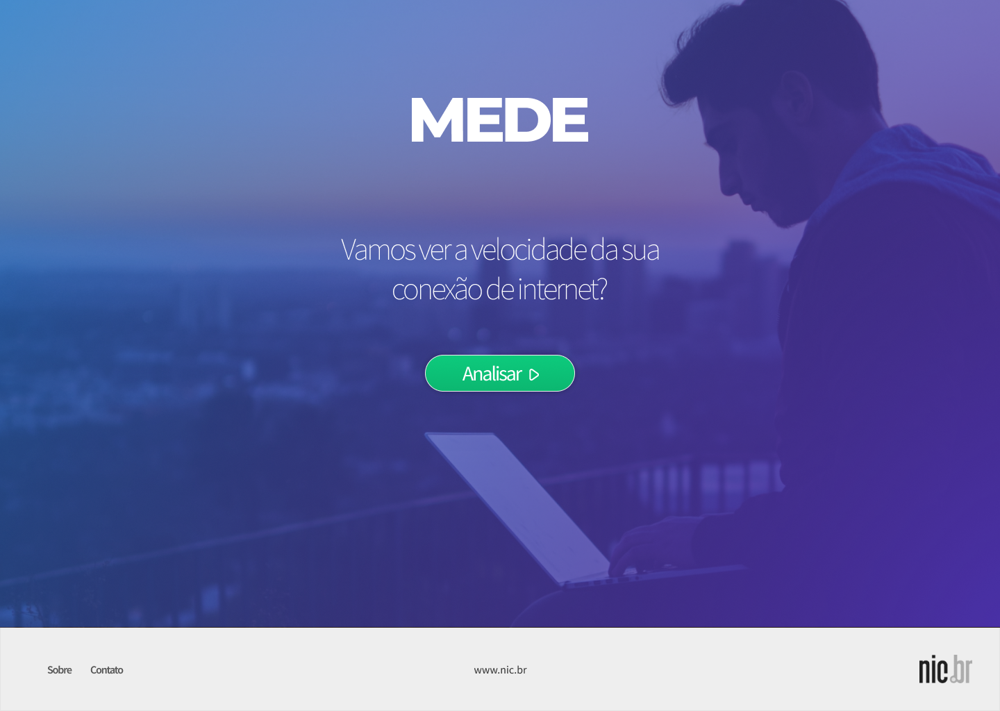
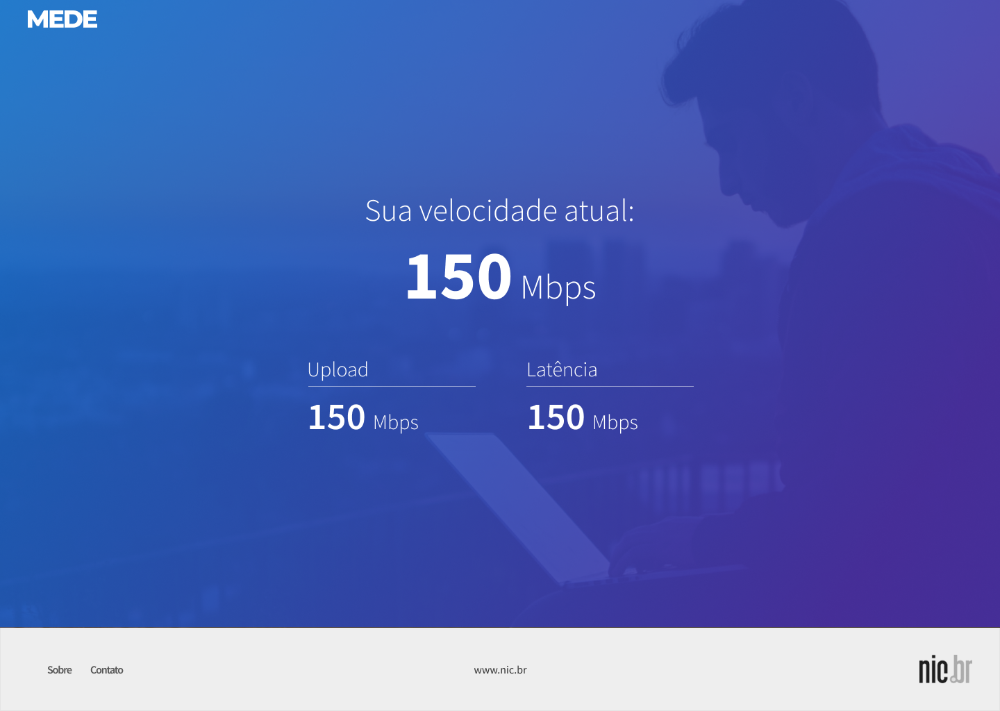

# MEDE


## Aplicação feita com ReactJS, React-Router, Styled-Components, Webpack

Aplicação criada a partir de um desafio proposto.

A proposta consiste em criar uma aplicação onde o usuário pode medir a sua velocidade de conexão com a internet.

Eu tinha a total liberdade de desenhar e desenvolver a aplicação a minha maneira e visão de produto.

Assim, pensei em uma aplicação simples, focada na sua função, sem grandes distrações para o usuário, mas também não queria que fosse algo como um sistema super complexo, o que também poderia distrair o usuário.

Requisitos básicos do desafio:

- O usuário poderia registrar o seu nome, como um login, e essa informação persistir em tela.
- O usuário poderia medir a sua velocidade de conexão
- Essa velocidade medida, fica gravada para o usuário.
- Ele poderia ver um histórico das suas medições.

Abaixo as primeiras telas do produto:





O processo de criação do produto, após essas primeiras telas, fui criando durante o desenvolvimento, usando realmente a aplicação e verificando as necessidades.

## Como usar

Para rodar o projeto, é necessário ter o [NodeJS + NPM](https://nodejs.org/en/) instalado na sua máquina.

No terminal, rode os comandos abaixo:

```sh
npm install
```

```sh
npm start
```

O projeto vai rodar no endereço abaixo:

```sh
http://localhost:8080/
```

## Ainda existem pontos pendentes no projeto:

- Melhorar a estrutura do painel, quando os elementos vão surgindo na tela. Algumas interações estão secas.
- Landing page - Adicionar animações css nos elementos, tanto na abertura da página, tanto quando clicamos para ir ao painel.
- Histórico - Adicionar botão para limpar o histórico.
- Ao salvar o histórico, verificar se o usuário esta "logado". Senão, solicitar o login.
